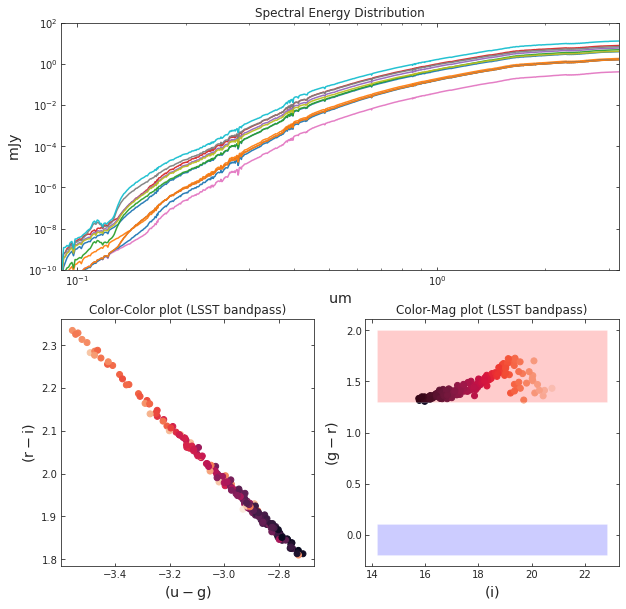
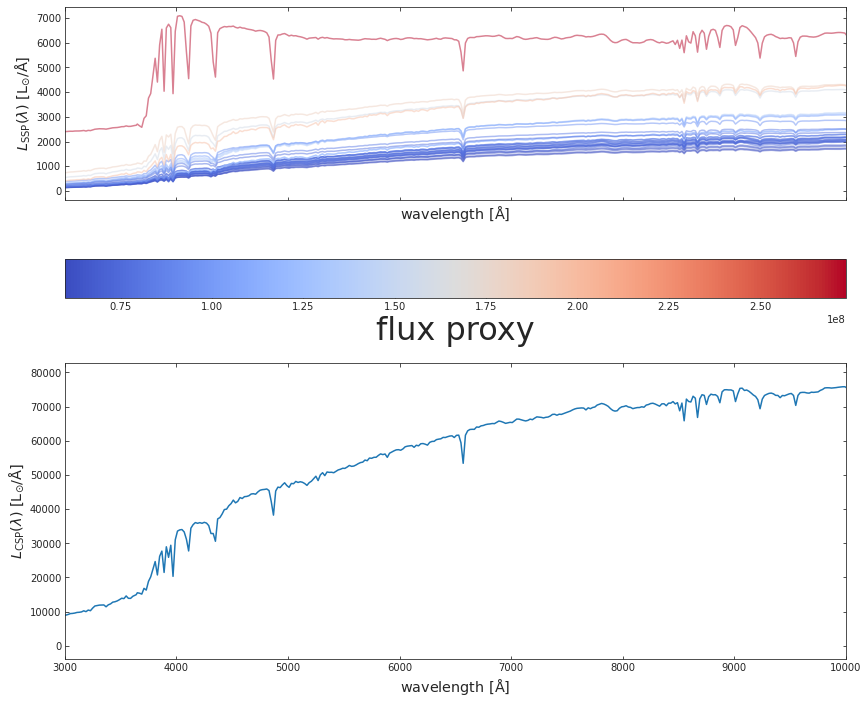
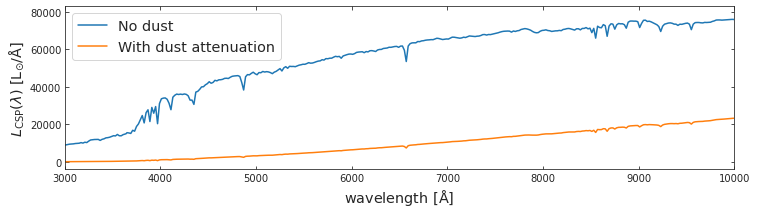
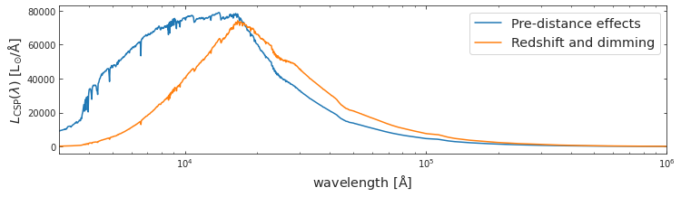
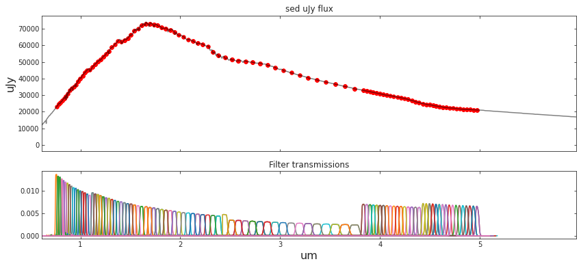
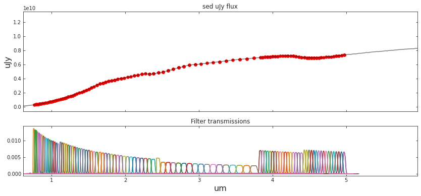
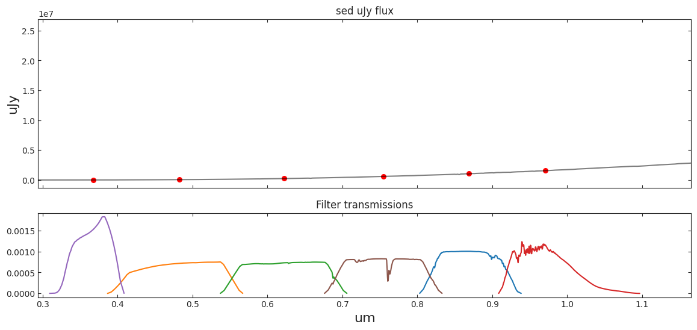

# WATERCOLOR

<!-- WARNING: THIS FILE WAS AUTOGENERATED! DO NOT EDIT! -->

## Installation

Temporary installation:

``` sh
pip install git+https://github.com/nesar/watercolor.git
```

Future:

``` sh
pip install watercolor
```

## Simple implementation

``` python
from watercolor.paint import photometry_from_catalog
```

``` python
galaxy_star_catalog_file='../watercolor/data/test_hacc_stellar_catalog/Gal_Z1.txt' # HACC galaxy catalog
final_sed_uJy, final_wave_um, lsst_mags, spherex_mags, cosmos_mags = photometry_from_catalog(galaxy_star_catalog_file)
```

    Number of galaxies: 168

``` python
# Plotting SEDs and LSST colors
f, ax = plt.subplots(1, 2, figsize=(16, 5), gridspec_kw={'width_ratios': [2, 1]})

for gal_id in np.random.randint(0, final_sed_uJy.shape[0], 24):
    ax[0].plot(final_wave_um[gal_id], final_sed_uJy[gal_id], label=str(gal_id), alpha=0.8)

ax[0].set_xlim(0.09, 4.2)
ax[0].set_ylim(1e-4, 1e5)
ax[0].set_xscale('log')
ax[0].set_yscale('log')

ax[0].set_xlabel(r'${\rm um}$', fontsize = 'x-large')
ax[0].set_ylabel(r'${\rm mJy}}$', fontsize = 'x-large')
# ax[0].legend(fontsize='x-large', ncol=3, title='Galaxy number')


u, g, r, i, z, Y = lsst_mags.T

ax[1].scatter(g-r, r-i, c=range(final_sed_uJy.shape[0]))
ax[1].set_xlabel(r'${\rm (g-r)}$', fontsize = 'x-large')
ax[1].set_ylabel(r'${\rm (r-i)}$', fontsize = 'x-large')

plt.show()
```



## Behind the scenes

#### 1. First we import the following modules of hydro_colors

``` python
import watercolor
from watercolor.load_sim_stellar_catalog import load_hacc_galaxy_data
from watercolor.calculate_csp import calc_fluxes_for_galaxy
from watercolor.load_sps_library import LIBRARY_FLUX_FILE, LIBRARY_WAVE_FILE, LIBRARY_AGE_FILE, LIBRARY_METAL_FILE
from watercolor.dust_attenuation import spectrum_dusted, log_total_stellar_metal, log_total_stellar_mass
from watercolor.cosmic_distance_effects import combine_redshift_and_dimming_effect
from watercolor.filter_convolution import load_survey_pickle, photometry_from_spectra
```

#### 2. Then the galaxy-star catalog from HACC is loaded, using a unique galaxy tag, we select a galaxy

``` python
fof_halo_tag, if_satellite, galaxy_tags, stellar_idx, metal_hydro, mass, age_hydro, x, y, z , vx, vy, vz = watercolor.load_sim_stellar_catalog.load_hacc_galaxy_data(galaxy_star_catalog_file)
```

``` python
galaxy_number = 8 # Choosing one of the galaxies in the catalog
unique_galaxy_tag = np.unique(galaxy_tags)[galaxy_number]
print('Number of galaxies: %d'%np.unique(galaxy_tags).shape[0])

mstar_i = mass[galaxy_tags == unique_galaxy_tag]
metal_i = metal_hydro[galaxy_tags == unique_galaxy_tag]
if_satellite_i = if_satellite[galaxy_tags == unique_galaxy_tag]

logZ = log_total_stellar_metal(metal_i, mstar_i)
logmstar = log_total_stellar_mass(mstar_i)
```

    Number of galaxies: 168

#### 3. After selecting a unique galaxy tag, we calculate the SED. This is the rest-frame SED is due to spectral emission alone, and without dust attenuation.

``` python
spec_wave_ssp, spec_flux_ssp, spec_csp, flux_proxy, gal_stellar_mass = watercolor.calculate_csp.calc_fluxes_for_galaxy(galaxy_star_catalog_file,
                                                                                                                       unique_galaxy_tag,
                                                                                                                       LIBRARY_FLUX_FILE,
                                                                                                                       LIBRARY_WAVE_FILE,
                                                                                                                       LIBRARY_AGE_FILE,
                                                                                                                       LIBRARY_METAL_FILE)
```

#### 4. We plot SEDs from both SSPs and CSPs

``` python
fig, a = plt.subplots(2,1, figsize=(14, 12), sharex=True, sharey=False)
c_norm = mpl.colors.Normalize(vmin=np.min(flux_proxy), vmax=np.max(flux_proxy))
c_map  = mpl.cm.coolwarm

s_map  = mpl.cm.ScalarMappable(cmap=c_map, norm=c_norm)
s_map.set_array([])


for idx in range(spec_flux_ssp.shape[0]):
    
    # spec_flux_ssp[idx] = spec_ssp(age_hydro[ssp_id], metal_hydro[ssp_id], mass[ssp_id])
    a[0].plot(spec_wave_ssp, spec_flux_ssp[idx], 
              # color=s_map.to_rgba(np.log10(mass[ssp_id])), 
              color=s_map.to_rgba(flux_proxy[idx]), 
              alpha=0.5)

fig.colorbar(s_map, ax = a[0], 
             orientation = 'horizontal', 
             # label=r'stellar mass', pad=0.2)
             label=r'flux proxy', pad=0.2)
    

#####################################################################

a[1].plot(spec_wave_ssp, spec_csp)


# a[0].set_ylim(1e-9, 1e-6)
# a[0].set_yscale('log')
# a[1].set_yscale('log')
# a[1].set_xscale('log')
a[1].set_xlim(3e3, 1e4)


a[0].set_xlabel(r'${\rm wavelength\ [\AA]}$', fontsize = 'x-large')
a[1].set_xlabel(r'${\rm wavelength\ [\AA]}$', fontsize = 'x-large')
a[0].set_ylabel(r'$L_{\rm SSP}(\lambda)\ {\rm [L_{\odot}/\AA]}$', fontsize = 'x-large')
a[1].set_ylabel(r'$L_{\rm CSP}(\lambda)\ {\rm [L_{\odot}/\AA]}$', fontsize = 'x-large')


plt.show()
```



#### 5. CSPs are attenuation due to dust

``` python
spec_wave_csp_dusted = spectrum_dusted(spec_csp, spec_wave_ssp, logmstar, logZ, 0.01)
```

``` python
f, a = plt.subplots(1, 1, figsize=(12, 3))
a.plot(spec_wave_ssp, spec_csp, label='No dust')
a.plot(spec_wave_ssp, spec_wave_csp_dusted, label='With dust attenuation')

a.set_xlim(3e3, 1e4)

a.set_xlabel(r'${\rm wavelength\ [\AA]}$', fontsize = 'x-large')
a.set_ylabel(r'$L_{\rm CSP}(\lambda)\ {\rm [L_{\odot}/\AA]}$', fontsize = 'x-large')
a.legend(fontsize='x-large')
```

    <matplotlib.legend.Legend>



#### 6. The resulting dust attenuated spectra undergoes cosmic dimming and redshifting

``` python
redsh_wave, redsh_spec = combine_redshift_and_dimming_effect(wave=spec_wave_ssp, 
                                                             spec=spec_wave_csp_dusted, 
                                                             galaxy_redshift=0.001)
```

``` python
f, a = plt.subplots(1, 1, figsize=(12, 3))
a.plot(spec_wave_ssp, spec_csp, label='Pre-distance effects')
a.plot(redsh_wave, redsh_spec*1e6, label='Redshift and dimming')


# a.set_xlim(3e3, 1e4)
a.set_xlim(3e3, 1e6)

a.set_xscale('log')
# a.set_yscale('log')

a.set_xlabel(r'${\rm wavelength\ [\AA]}$', fontsize = 'x-large')
a.set_ylabel(r'$L_{\rm CSP}(\lambda)\ {\rm [L_{\odot}/\AA]}$', fontsize = 'x-large')
a.legend(fontsize='x-large')
```

    <matplotlib.legend.Legend>



#### 7. The final spectrum is convolved with telescope transmission curves to obtain magnitudes

``` python
##### Load survey filters 

SURVEY_STRING = 'SPHEREx'
central_wavelengths, bandpass_wavs, bandpass_vals, bandpass_names = load_survey_pickle(SURVEY_STRING)

##### Compute bandpasses

# sed_um_wave = spec_wave_ssp/1e4
# sed_mJy_flux = spec_csp*1e3
sed_um_wave = redsh_wave/1e4
sed_mJy_flux = redsh_spec*1e3

flux_survey, appmag_ext_survey, band_fluxes_survey = photometry_from_spectra(central_wavelengths, 
                                                                          sed_um_wave, 
                                                                          sed_mJy_flux, 
                                                                          bandpass_wavs, 
                                                                          bandpass_vals, 
                                                                          bandpass_names,
                                                                          interp_kind='linear',
                                                                          plot=True,
                                                                          clip_bandpass=True)
```



``` python
##### Load survey filters 

SURVEY_STRING = 'LSST'
central_wavelengths, bandpass_wavs, bandpass_vals, bandpass_names = load_survey_pickle(SURVEY_STRING)

##### Compute bandpasses

# sed_um_wave = spec_wave_ssp/1e4
# sed_mJy_flux = spec_csp*1e3
sed_um_wave = redsh_wave/1e4
sed_mJy_flux = redsh_spec*1e3

flux_survey, appmag_ext_survey, band_fluxes_survey = photometry_from_spectra(central_wavelengths, 
                                                                          sed_um_wave, 
                                                                          sed_mJy_flux, 
                                                                          bandpass_wavs, 
                                                                          bandpass_vals, 
                                                                          bandpass_names,
                                                                          interp_kind='linear',
                                                                          plot=True,
                                                                          clip_bandpass=True)
```



``` python
##### Load survey filters 

SURVEY_STRING = 'COSMOS'
central_wavelengths, bandpass_wavs, bandpass_vals, bandpass_names = load_survey_pickle(SURVEY_STRING)


##### Compute bandpasses

# sed_um_wave = spec_wave_ssp/1e4
# sed_mJy_flux = spec_csp*1e3
sed_um_wave = redsh_wave/1e4
sed_mJy_flux = redsh_spec*1e3

flux_survey, appmag_ext_survey, band_fluxes_survey = photometry_from_spectra(central_wavelengths, 
                                                                          sed_um_wave, 
                                                                          sed_mJy_flux, 
                                                                          bandpass_wavs, 
                                                                          bandpass_vals, 
                                                                          bandpass_names,
                                                                          interp_kind='linear',
                                                                          plot=True,
                                                                          clip_bandpass=True)
```



<!-- ### One can also find luminosity profiles for the simulated galaxies -->
<!-- #### 1. First we project the luminosity on to grids -->
<!-- #### 2. Next we plot the stellar density and luminosity profiles -->
<!-- ### Radial mass profile of the galaxy -->
<!-- ## Under the hood -->
