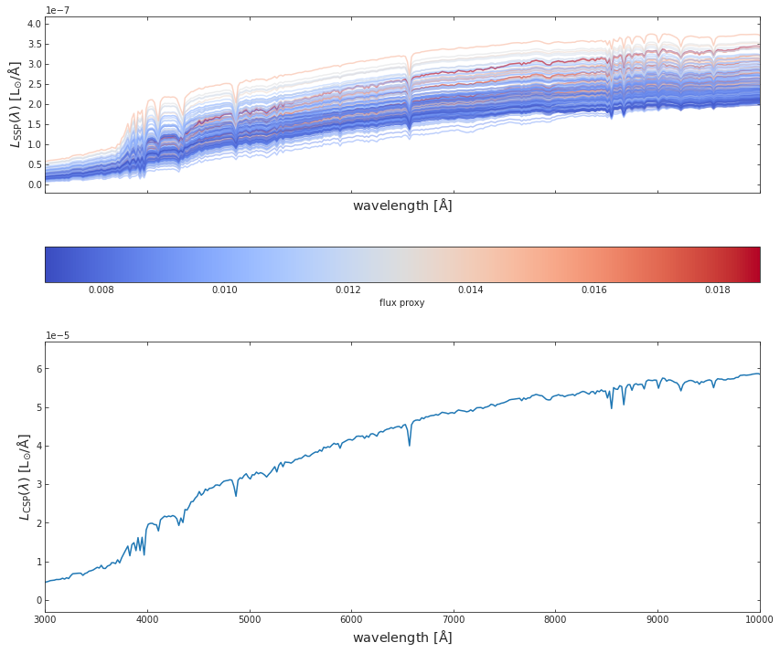
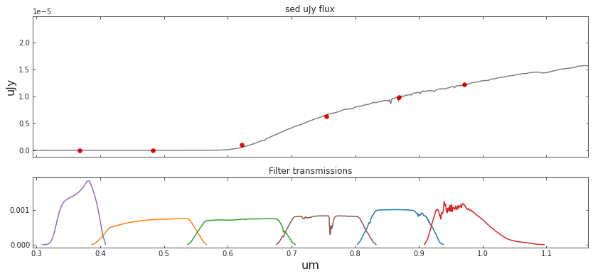
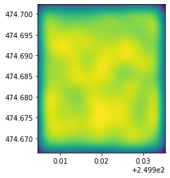
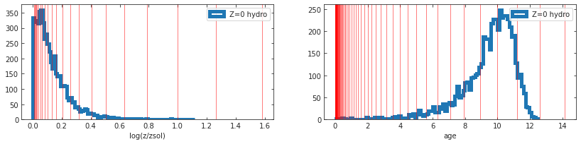
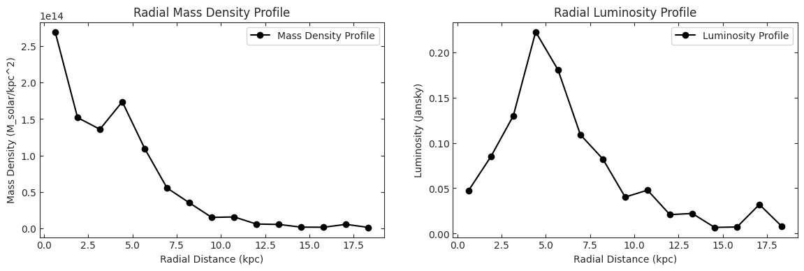
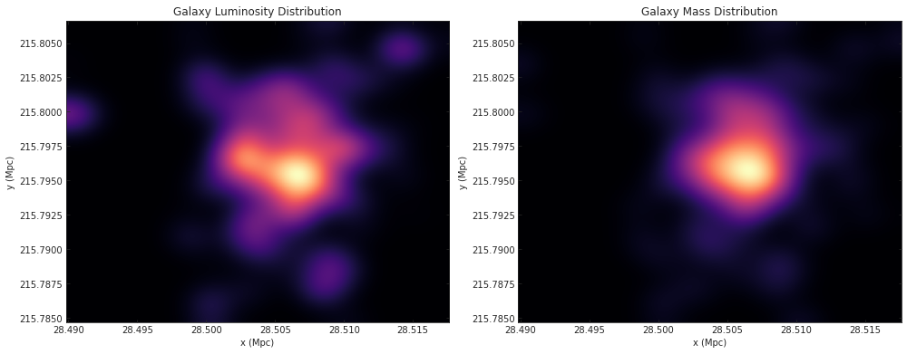

# WATERCOLOR

<!-- WARNING: THIS FILE WAS AUTOGENERATED! DO NOT EDIT! -->

## Installation

Temporary installation:

``` sh
pip install git+https://github.com/nesar/watercolor.git
```

Future:

``` sh
pip install watercolor
```

## Simple implementation

``` python
from watercolor.paint import photometry_from_catalog
```

#### First we load the galaxy catalog. The main physical quantities required for painting the colors are the metallicities, stellar mass and age of the star particles of a galaxy.

``` python
galaxy_star_catalog_file='../watercolor/data/test_hacc_stellar_catalog/Gal_z0_hbin.txt' # HACC galaxy catalog
final_sed_mJy, final_wave_um, lsst_mags, spherex_mags, cosmos_mags = photometry_from_catalog(galaxy_star_catalog_file)
```

    Number of galaxies: 200

#### The single-line command provides the SEDs and magnitudes from LSST, SPHEREx and COSMOS filters

``` python
# Create the main figure and a gridspec object
fig = plt.figure(figsize=(10, 10))
gs = gridspec.GridSpec(2, 2, height_ratios=[1,1])

# Create the three subplots
ax0 = fig.add_subplot(gs[0, :])  # Top panel spanning both columns
ax1 = fig.add_subplot(gs[1, 0])  # Bottom left panel
ax2 = fig.add_subplot(gs[1, 1])  # Bottom right panel


ax0.set_title('Spectral Energy Distribution')
ax1.set_title('Color-Color plot (LSST bandpass)')
ax2.set_title('Color-Mag plot (LSST bandpass)')


np.random.seed(2)
for gal_id in np.random.randint(0, final_sed_mJy.shape[0], 12):
    ax0.plot(final_wave_um[gal_id], final_sed_mJy[gal_id], label=str(gal_id), alpha=0.94)

ax0.set_xlim(0.09, 3.2)
ax0.set_ylim(1e-10, 1e2)
ax0.set_xscale('log')
ax0.set_yscale('log')

ax0.set_xlabel(r'${\rm um}$', fontsize = 'x-large')
ax0.set_ylabel(r'${\rm mJy}}$', fontsize = 'x-large')
# ax[0].legend(fontsize='x-large', ncol=3, title='Galaxy number')
    
u, g, r, i, z, Y = lsst_mags.T

ax1.scatter(u-g, r-i, c=Y)
ax1.set_xlabel(r'${\rm (u-g)}$', fontsize = 'x-large')
ax1.set_ylabel(r'${\rm (r-i)}$', fontsize = 'x-large')

ax2.scatter(i, g-r, c=u)
ax2.set_xlabel(r'${\rm (i)}$', fontsize = 'x-large')
ax2.set_ylabel(r'${\rm (g-r)}$', fontsize = 'x-large')
# ax[2].axhline(y=1.3, color='red')
# ax[2].axhline(y=0.1, color='blue')
ax2.fill_between( np.linspace(0.9*i.min(), 1.1*i.max(), 100), 1.3, 2.0,  facecolor='red', alpha=0.2, interpolate=True)
ax2.fill_between( np.linspace(0.9*i.min(), 1.1*i.max(), 100), -0.2, 0.1,  facecolor='blue', alpha=0.2, interpolate=True)

plt.show()
```


## Behind the scenes

#### 1. First we import the following modules of hydro_colors

``` python
import watercolor
from watercolor.load_sim_stellar_catalog import load_hacc_galaxy_data
from watercolor.calculate_csp import calc_fluxes_for_galaxy
from watercolor.load_sps_library import LIBRARY_FLUX_FILE, LIBRARY_WAVE_FILE, LIBRARY_AGE_FILE, LIBRARY_METAL_FILE
from watercolor.dust_attenuation import spectrum_dusted, log_total_stellar_metal, log_total_stellar_mass
from watercolor.cosmic_distance_effects import combine_redshift_and_dimming_effect
from watercolor.filter_convolution import load_survey_pickle, photometry_from_spectra
```

#### 2. Then the galaxy-star catalog from HACC is loaded, using a unique galaxy tag, we select a galaxy

``` python
fof_halo_tag, if_satellite, galaxy_tags, stellar_idx, metal_hydro, mass, age_hydro, x, y, z , vx, vy, vz = watercolor.load_sim_stellar_catalog.load_hacc_galaxy_data(galaxy_star_catalog_file)
```

``` python
galaxy_number = 4 # Choosing one of the galaxies in the catalog
unique_galaxy_tag = np.unique(galaxy_tags)[galaxy_number]
print('Number of galaxies: %d'%np.unique(galaxy_tags).shape[0])

mstar_i = mass[galaxy_tags == unique_galaxy_tag]
metal_i = metal_hydro[galaxy_tags == unique_galaxy_tag]
if_satellite_i = if_satellite[galaxy_tags == unique_galaxy_tag]

logZ = log_total_stellar_metal(metal_i, mstar_i)
logmstar = log_total_stellar_mass(mstar_i)
```

    Number of galaxies: 200

#### 3. After selecting a unique galaxy tag, we calculate the SED. This is the rest-frame SED is due to spectral emission alone, and without dust attenuation.

``` python
spec_wave_ssp, spec_flux_ssp, spec_csp, flux_proxy, gal_stellar_mass = watercolor.calculate_csp.calc_fluxes_for_galaxy(galaxy_star_catalog_file,
                                                                                                                       unique_galaxy_tag,
                                                                                                                       LIBRARY_FLUX_FILE,
                                                                                                                       LIBRARY_WAVE_FILE,
                                                                                                                       LIBRARY_AGE_FILE,
                                                                                                                       LIBRARY_METAL_FILE)
```

#### 4. We plot SEDs from both SSPs and CSPs

``` python
fig, a = plt.subplots(2,1, figsize=(14, 12), sharex=True, sharey=False)
c_norm = mpl.colors.Normalize(vmin=np.min(flux_proxy), vmax=np.max(flux_proxy))
c_map  = mpl.cm.coolwarm

s_map  = mpl.cm.ScalarMappable(cmap=c_map, norm=c_norm)
s_map.set_array([])


for idx in range(spec_flux_ssp.shape[0]):
    
    # spec_flux_ssp[idx] = spec_ssp(age_hydro[ssp_id], metal_hydro[ssp_id], mass[ssp_id])
    a[0].plot(spec_wave_ssp, spec_flux_ssp[idx], 
              # color=s_map.to_rgba(np.log10(mass[ssp_id])), 
              color=s_map.to_rgba(flux_proxy[idx]), 
              alpha=0.5)

fig.colorbar(s_map, ax = a[0], 
             orientation = 'horizontal', 
             # label=r'stellar mass', pad=0.2)
             label=r'flux proxy', pad=0.2)
    

#####################################################################

a[1].plot(spec_wave_ssp, spec_csp)


# a[0].set_ylim(1e-9, 1e-6)
# a[0].set_yscale('log')
# a[1].set_yscale('log')
# a[1].set_xscale('log')
a[1].set_xlim(3e3, 1e4)


a[0].set_xlabel(r'${\rm wavelength\ [\AA]}$', fontsize = 'x-large')
a[1].set_xlabel(r'${\rm wavelength\ [\AA]}$', fontsize = 'x-large')
a[0].set_ylabel(r'$L_{\rm SSP}(\lambda)\ {\rm [L_{\odot}/\AA]}$', fontsize = 'x-large')
a[1].set_ylabel(r'$L_{\rm CSP}(\lambda)\ {\rm [L_{\odot}/\AA]}$', fontsize = 'x-large')


plt.show()
```



#### 5. CSPs are attenuation due to dust

``` python
spec_wave_csp_dusted = spectrum_dusted(spec_csp, spec_wave_ssp, logmstar, logZ, 0.01)
```

``` python
f, a = plt.subplots(1, 1, figsize=(12, 3))
a.plot(spec_wave_ssp, spec_csp, label='No dust')
a.plot(spec_wave_ssp, spec_wave_csp_dusted, label='With dust attenuation')

a.set_xlim(3e3, 1e4)

a.set_xlabel(r'${\rm wavelength\ [\AA]}$', fontsize = 'x-large')
a.set_ylabel(r'$L_{\rm CSP}(\lambda)\ {\rm [L_{\odot}/\AA]}$', fontsize = 'x-large')
a.legend(fontsize='x-large')
```

    <matplotlib.legend.Legend>



#### 6. The resulting dust attenuated spectra undergoes cosmic dimming and redshifting

``` python
redsh_wave, redsh_spec = combine_redshift_and_dimming_effect(wave=spec_wave_ssp, 
                                                             spec=spec_wave_csp_dusted, 
                                                             galaxy_redshift=0.001)
```

``` python
f, a = plt.subplots(1, 1, figsize=(12, 3))
a.plot(spec_wave_ssp, spec_csp, label='Pre-distance effects')
a.plot(redsh_wave, redsh_spec*1e6, label='Redshift and dimming')


# a.set_xlim(3e3, 1e4)
a.set_xlim(3e3, 1e6)

a.set_xscale('log')
# a.set_yscale('log')

a.set_xlabel(r'${\rm wavelength\ [\AA]}$', fontsize = 'x-large')
a.set_ylabel(r'$L_{\rm CSP}(\lambda)\ {\rm [L_{\odot}/\AA]}$', fontsize = 'x-large')
a.legend(fontsize='x-large')
```

    <matplotlib.legend.Legend>



#### 7. The final spectrum is convolved with telescope transmission curves to obtain magnitudes

``` python
##### Load survey filters 

SURVEY_STRING = 'SPHEREx'
central_wavelengths, bandpass_wavs, bandpass_vals, bandpass_names = load_survey_pickle(SURVEY_STRING)

##### Compute bandpasses

# sed_um_wave = spec_wave_ssp/1e4
# sed_mJy_flux = spec_csp*1e3
sed_um_wave = redsh_wave/1e4
sed_mJy_flux = redsh_spec*1e3

flux_survey, appmag_ext_survey, band_fluxes_survey = photometry_from_spectra(central_wavelengths, 
                                                                          sed_um_wave, 
                                                                          sed_mJy_flux, 
                                                                          bandpass_wavs, 
                                                                          bandpass_vals, 
                                                                          bandpass_names,
                                                                          interp_kind='linear',
                                                                          plot=True,
                                                                          clip_bandpass=True)
```


``` python
##### Load survey filters 

SURVEY_STRING = 'LSST'
central_wavelengths, bandpass_wavs, bandpass_vals, bandpass_names = load_survey_pickle(SURVEY_STRING)

##### Compute bandpasses

# sed_um_wave = spec_wave_ssp/1e4
# sed_mJy_flux = spec_csp*1e3
sed_um_wave = redsh_wave/1e4
sed_mJy_flux = redsh_spec*1e3

flux_survey, appmag_ext_survey, band_fluxes_survey = photometry_from_spectra(central_wavelengths, 
                                                                          sed_um_wave, 
                                                                          sed_mJy_flux, 
                                                                          bandpass_wavs, 
                                                                          bandpass_vals, 
                                                                          bandpass_names,
                                                                          interp_kind='linear',
                                                                          plot=True,
                                                                          clip_bandpass=True)
```


``` python
##### Load survey filters 

SURVEY_STRING = 'COSMOS'
central_wavelengths, bandpass_wavs, bandpass_vals, bandpass_names = load_survey_pickle(SURVEY_STRING)


##### Compute bandpasses

# sed_um_wave = spec_wave_ssp/1e4
# sed_mJy_flux = spec_csp*1e3
sed_um_wave = redsh_wave/1e4
sed_mJy_flux = redsh_spec*1e3

flux_survey, appmag_ext_survey, band_fluxes_survey = photometry_from_spectra(central_wavelengths, 
                                                                          sed_um_wave, 
                                                                          sed_mJy_flux, 
                                                                          bandpass_wavs, 
                                                                          bandpass_vals, 
                                                                          bandpass_names,
                                                                          interp_kind='linear',
                                                                          plot=True,
                                                                          clip_bandpass=True)
```



## Profiles of the galaxies can be checked too

``` python
def radial_luminosity_profile(data, 
                              num_bins=15):
    # Calculate the radial distances for each point
    
    data[:, 0] = data[:, 0] - np.mean(data[:, 0])
    data[:, 1] = data[:, 1] - np.mean(data[:, 1])
    
    r = np.sqrt(data[:, 0]**2 + data[:, 1]**2)
    
    # Bin data and sum luminosities within each bin
    bin_edges = np.linspace(0, r.max(), num_bins+1)
    luminosity, _ = np.histogram(r, bins=bin_edges, weights=data[:, 2])
    
    # Return the bin centers and corresponding luminosities
    bin_centers = (bin_edges[:-1] + bin_edges[1:]) / 2
    return bin_centers, luminosity

def radial_mass_density_from_lum(data, 
                                 num_bins=15):
    
    data[:, 0] = data[:, 0] - np.mean(data[:, 0])
    data[:, 1] = data[:, 1] - np.mean(data[:, 1])
    
    # Calculate the radial distances for each point
    r = np.sqrt(data[:, 0]**2 + data[:, 1]**2)
    
    # Bin data and sum "masses" (luminosities) within each bin
    bin_edges = np.linspace(0, r.max(), num_bins+1)
    total_mass, _ = np.histogram(r, bins=bin_edges, weights=data[:, 3])
    
    # Calculate the area of each annulus: π(R_outer^2 - R_inner^2)
    areas = np.pi * (bin_edges[1:]**2 - bin_edges[:-1]**2)
    
    # Compute mass density
    mass_density = total_mass / areas
    
    # Return the bin centers and corresponding mass densities
    bin_centers = (bin_edges[:-1] + bin_edges[1:]) / 2
    return bin_centers, mass_density
```

``` python
gal_tag_cond = np.where(galaxy_tags == unique_galaxy_tag)

x_select =  (x[gal_tag_cond])# - np.mean(x[gal_tag_cond]))/(np.max(x[gal_tag_cond]) - np.min(x[gal_tag_cond]))
y_select =  (y[gal_tag_cond])# - np.mean(y[gal_tag_cond]))/(np.max(y[gal_tag_cond]) - np.min(y[gal_tag_cond]))

z_select = np.trapz(spec_flux_ssp, spec_wave_ssp)
m_select = mass[gal_tag_cond]
```

``` python
bin_centers, mass_densities_direct = radial_mass_density_from_lum(np.array([x_select, y_select, z_select, m_select]).T)

# # Plotting the radial mass density profile (direct from luminosity)
f, a = plt.subplots(1, 2, figsize=(14, 4))


# Plotting the radial mass density profile
a[0].plot(bin_centers, mass_densities_direct, '-ko', label='Mass Density Profile')
a[0].set_xlabel('Radial Distance (kpc)')
a[0].set_ylabel('Mass Density (M_solar/kpc^2)')
a[0].set_title('Radial Mass Density Profile')
a[0].legend()


bin_centers, luminosities = radial_luminosity_profile(np.array([x_select, y_select, z_select, m_select]).T)

# Plotting the radial luminosity profile
a[1].plot(bin_centers, luminosities, '-ko', label='Luminosity Profile')
a[1].set_xlabel('Radial Distance (kpc)')
a[1].set_ylabel('Luminosity (Jansky)')
a[1].set_title('Radial Luminosity Profile')
a[1].legend()
plt.show()
```



``` python
from scipy.ndimage import gaussian_filter
```

``` python
def canvas_plot(data, 
                canvas_size = 256, 
                gauss_sigma = 12):
    
    # Create a blank canvas
    # size of the canvas for the image
    canvas = np.zeros((canvas_size, canvas_size))

    # Translate the x, y values to fit the canvas
    x_scaled = ((data[:, 0] - data[:, 0].min()) / (data[:, 0].max() - data[:, 0].min()) * canvas_size).astype(int)
    y_scaled = ((data[:, 1] - data[:, 1].min()) / (data[:, 1].max() - data[:, 1].min()) * canvas_size).astype(int)


    # Adjust the scaling to ensure values are within the bounds of the canvas
    x_scaled = np.clip(x_scaled, 0, canvas_size - 1)
    y_scaled = np.clip(y_scaled, 0, canvas_size - 1)

    # Reset the canvas
    canvas = np.zeros((canvas_size, canvas_size))

    # Place stars on the canvas using their luminosity
    for x_ind, y_ind, quant_ind in zip(x_scaled, y_scaled, data[:, 2]):
        canvas[y_ind, x_ind] += quant_ind

    # Apply a Gaussian blur to emulate the glow of stars
    blurred_canvas = gaussian_filter(canvas, sigma=gauss_sigma)
    
    return blurred_canvas
```

``` python
blurred_canvas_lum = canvas_plot(np.array([x_select, y_select, z_select]).T)
blurred_canvas_mass = canvas_plot(np.array([x_select, y_select, m_select]).T)
```

``` python
f, a = plt.subplots(1, 2, figsize=(14, 8))
cmap_select = 'magma'
a[0].imshow(blurred_canvas_lum, cmap=cmap_select, origin='lower', extent=[x_select.min(), x_select.max(), y_select.min(), y_select.max()])
# a[0].colorbar(label='Luminosity (Jansky)')
a[0].set_title('Galaxy Luminosity Distribution')
a[0].set_xlabel('x (Mpc)')
a[0].set_ylabel('y (Mpc)')
a[0].set_aspect('equal', 'box')


a[1].imshow(blurred_canvas_mass, cmap=cmap_select, origin='lower', extent=[x_select.min(), x_select.max(), y_select.min(), y_select.max()])
# a[1].colorbar(label='Mass (Msol)')
# a[1].scatter(x_scaled, y_scaled, s=1)
a[1].set_title('Galaxy Mass Distribution')
a[1].set_xlabel('x (Mpc)')
a[1].set_ylabel('y (Mpc)')
a[1].set_aspect('equal', 'box')

plt.tight_layout()
plt.show()
```



<!-- ### One can also find luminosity profiles for the simulated galaxies -->
<!-- #### 1. First we project the luminosity on to grids -->
<!-- #### 2. Next we plot the stellar density and luminosity profiles -->
<!-- ### Radial mass profile of the galaxy -->
<!-- ## Under the hood -->
