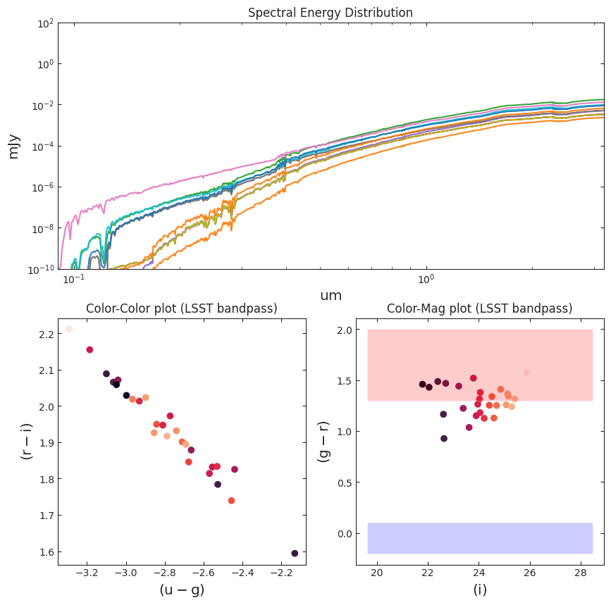
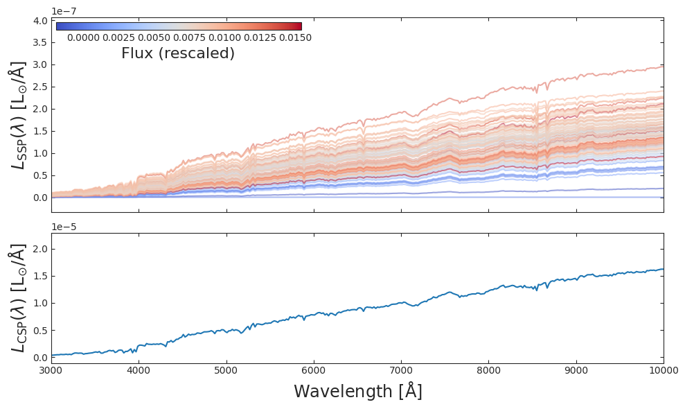
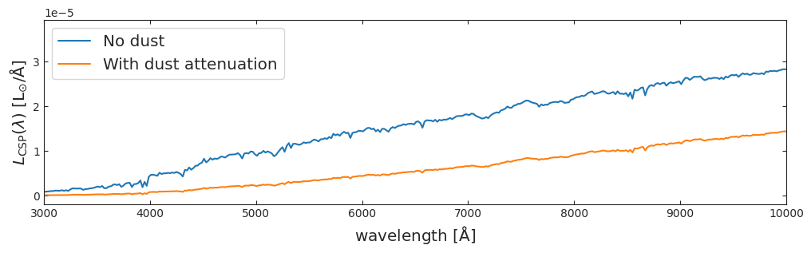
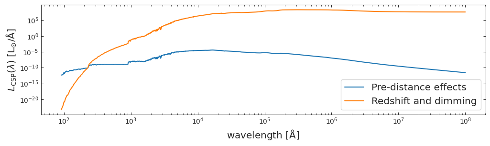
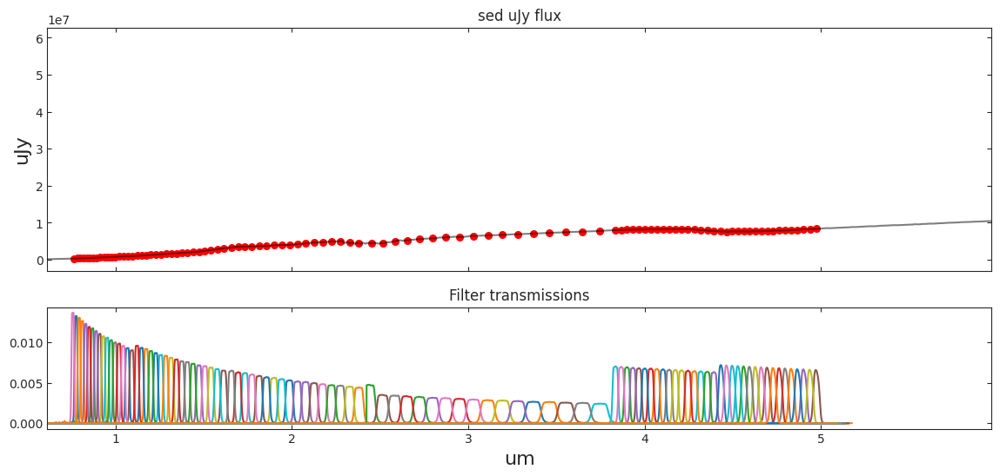
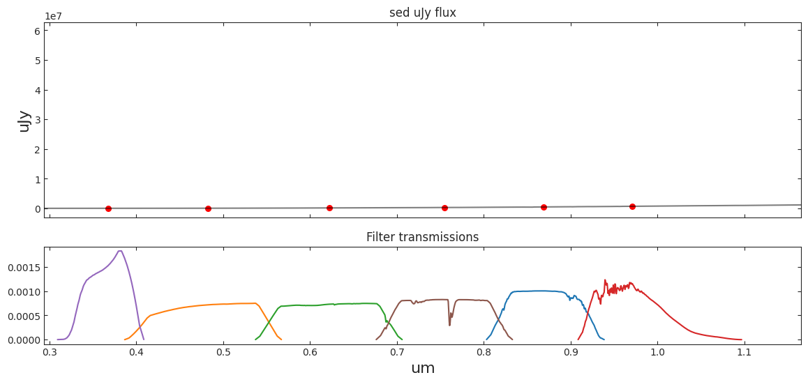
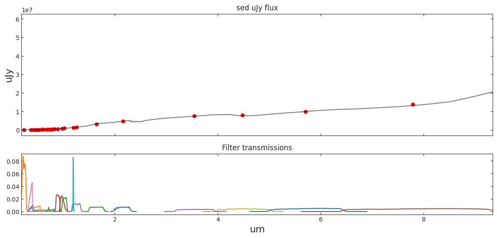
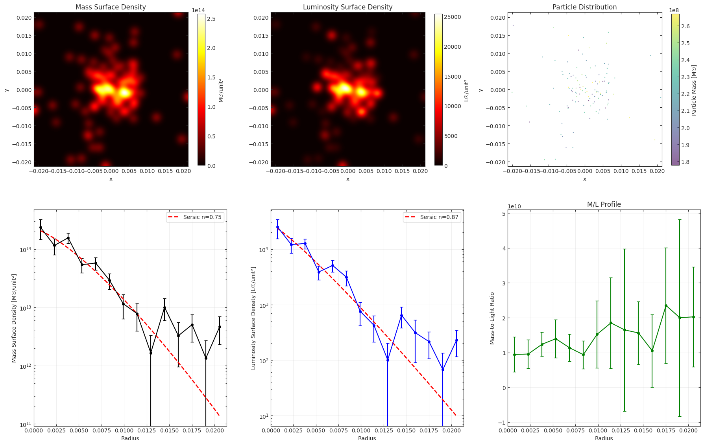

# WATERCOLOR

<!-- WARNING: THIS FILE WAS AUTOGENERATED! DO NOT EDIT! -->

## Installation

Temporary installation:

``` sh
pip install git+https://github.com/nesar/watercolor.git
```

Future:

``` sh
pip install watercolor
```

## Simple implementation

``` python
from watercolor.paint import photometry_from_catalog, photometry_from_catalog_opencosmo
```

    /lcrc/project/cosmo_ai/nramachandra/Projects/Hydro_paint/watercolor/watercolor/load_sim_stellar_catalog.py:13: UserWarning: pkg_resources is deprecated as an API. See https://setuptools.pypa.io/en/latest/pkg_resources.html. The pkg_resources package is slated for removal as early as 2025-11-30. Refrain from using this package or pin to Setuptools<81.
      import pkg_resources

#### First we load the galaxy catalog. The main physical quantities required for painting the colors are the metallicities, stellar mass and age of the star particles of a galaxy.

``` python
# galaxy_star_catalog_file='../watercolor/data/test_hacc_stellar_catalog/Gal_z0_hbin.txt' # HACC galaxy catalog
# final_sed_mJy, final_wave_um, lsst_mags, spherex_mags, cosmos_mags = photometry_from_catalog(galaxy_star_catalog_file)

galparticle_dir = "galaxyparticles/"
galproperty_dir = "galaxyproperties/"

particle_file_path = os.path.join(data_dir, galparticle_dir, "m000p-624.galaxyparticles.hdf5")
catalog_file_path = os.path.join(data_dir, galproperty_dir, "m000p-624.galaxyproperties.hdf5")


final_sed_mJy, final_wave_um, lsst_mags, spherex_mags, cosmos_mags = photometry_from_catalog_opencosmo(galaxy_star_catalog_file=catalog_file_path,
                                                                                              galaxy_star_particle_file=particle_file_path)
```

    Number of available haloes in the catalog:  43087
    Number of available haloes selected:  20
    Loaded 2612 particles from 27 galaxies in 20 haloes 
    Number of galaxies: 27

#### The single-line command provides the SEDs and magnitudes from LSST, SPHEREx and COSMOS filters

``` python
# Create the main figure and a gridspec object
fig = plt.figure(figsize=(10, 10))
gs = gridspec.GridSpec(2, 2, height_ratios=[1,1])

# Create the three subplots
ax0 = fig.add_subplot(gs[0, :])  # Top panel spanning both columns
ax1 = fig.add_subplot(gs[1, 0])  # Bottom left panel
ax2 = fig.add_subplot(gs[1, 1])  # Bottom right panel


ax0.set_title('Spectral Energy Distribution')
ax1.set_title('Color-Color plot (LSST bandpass)')
ax2.set_title('Color-Mag plot (LSST bandpass)')


np.random.seed(2)
for gal_id in np.random.randint(0, final_sed_mJy.shape[0], 12):
    ax0.plot(final_wave_um[gal_id], final_sed_mJy[gal_id], label=str(gal_id), alpha=0.94)

ax0.set_xlim(0.09, 3.2)
ax0.set_ylim(1e-10, 1e2)
ax0.set_xscale('log')
ax0.set_yscale('log')

ax0.set_xlabel(r'${\rm um}$', fontsize = 'x-large')
ax0.set_ylabel(r'${\rm mJy}$', fontsize = 'x-large')
# ax[0].legend(fontsize='x-large', ncol=3, title='Galaxy number')
    
u, g, r, i, z, Y = lsst_mags.T

ax1.scatter(u-g, g-r, c=Y)
ax1.set_xlabel(r'${\rm (u-g)}$', fontsize = 'x-large')
ax1.set_ylabel(r'${\rm (g-r)}$', fontsize = 'x-large')

ax2.scatter(i, g-r, c=u)
ax2.set_xlabel(r'${\rm (i)}$', fontsize = 'x-large')
ax2.set_ylabel(r'${\rm (g-r)}$', fontsize = 'x-large')
# ax[2].axhline(y=1.3, color='red')
# ax[2].axhline(y=0.1, color='blue')
ax2.fill_between( np.linspace(0.9*i.min(), 1.1*i.max(), 100), 1.3, 2.0,  facecolor='red', alpha=0.2, interpolate=True)
ax2.fill_between( np.linspace(0.9*i.min(), 1.1*i.max(), 100), -0.2, 0.1,  facecolor='blue', alpha=0.2, interpolate=True)


plt.show()
```



## Behind the scenes

#### 1. First we import the following modules of hydro_colors

``` python
import watercolor
from watercolor.load_sim_stellar_catalog import load_hacc_galaxy_data, load_hacc_galaxy_data_opencosmo
from watercolor.calculate_csp import calc_fluxes_for_individual_galaxy
from watercolor.load_sps_library import LIBRARY_FLUX_FILE, LIBRARY_WAVE_FILE, LIBRARY_AGE_FILE, LIBRARY_METAL_FILE
from watercolor.dust_attenuation import spectrum_dusted, log_total_stellar_metal, log_total_stellar_mass
from watercolor.cosmic_distance_effects import combine_redshift_and_dimming_effect
from watercolor.filter_convolution import load_survey_pickle, photometry_from_spectra
```

#### 2. Then the galaxy-star catalog from HACC is loaded, using a unique galaxy tag, we select a galaxy

``` python
particle_file_path = "/lcrc/project/cosmo_ai/nramachandra/Projects/Hydro_paint/Data/fromFE/haloparticles_2gpc.hdf5"
dirIn0 = "/lcrc/project/cosmo_ai/nramachandra/Projects/Hydro_paint/Data/fromSciDAC/128MPC_RUNS_HACC_5PARAM/reformat/"
dirIn1 = "KAPPA_2.127_EGW_0.479_SEED_7.143e5_VKIN_3794_EPS_9.752/output/"
dirIn2 = "step_624/"
dirIn3a = "galaxyparticles/"
dirIn3b = "galaxyproperties/"


particle_file_path = os.path.join(dirIn0, dirIn1, dirIn2, dirIn3a, "m000p-624.galaxyparticles.hdf5")
catalog_file_path = os.path.join(dirIn0, dirIn1, dirIn2, dirIn3b, "m000p-624.galaxyproperties.hdf5")
```

``` python
# fof_halo_tag, if_satellite, galaxy_tags, stellar_idx, metal_hydro, mass, age_hydro, x, y, z , vx, vy, vz = watercolor.load_sim_stellar_catalog.load_hacc_galaxy_data(galaxy_star_catalog_file)

fof_halo_tag, if_satellite, galaxy_tags, stellar_idx, metal_hydro, mass, age_hydro, x, y, z , vx, vy, vz = load_hacc_galaxy_data_opencosmo(particle_file_path=particle_file_path, 
                                                                                                                    catalog_file_path=catalog_file_path)
```

    Number of available haloes in the catalog:  43087
    Number of available haloes selected:  20
    Loaded 2612 particles from 27 galaxies in 20 haloes 

``` python
galaxy_number = 12# Choosing one of the galaxies in the catalog
unique_galaxy_tag = np.unique(galaxy_tags)[galaxy_number]

mstar_i = mass[galaxy_tags == unique_galaxy_tag]
metal_i = metal_hydro[galaxy_tags == unique_galaxy_tag]
if_satellite_i = if_satellite[galaxy_tags == unique_galaxy_tag]

logZ = log_total_stellar_metal(metal_i, mstar_i)
logmstar = log_total_stellar_mass(mstar_i)
print('Total stars:', mstar_i.size, 'logmstar:', logmstar)
```

    Total stars: 118 logmstar: [10.419917]

#### 3. After selecting a unique galaxy tag, we calculate the SED. This is the rest-frame SED is due to spectral emission alone, and without dust attenuation.

``` python
# spec_wave_ssp, spec_flux_ssp, spec_csp, flux_proxy, gal_stellar_mass = watercolor.calculate_csp.calc_fluxes_for_galaxy(catalog_file_path,
#                                                                                                                        particle_file_path,
#                                                                                                                        unique_galaxy_tag,
#                                                                                                                        LIBRARY_FLUX_FILE,
#                                                                                                                        LIBRARY_WAVE_FILE,
#                                                                                                                        LIBRARY_AGE_FILE,
#                                                                                                                        LIBRARY_METAL_FILE)


spec_wave_ssp, spec_flux_ssp, spec_csp, flux_proxy, gal_stellar_mass = calc_fluxes_for_individual_galaxy(
    galaxy_tags, 
    metal_hydro,
    mass,
    age_hydro,
    unique_galaxy_tag,
    LIBRARY_FLUX_FILE,
    LIBRARY_WAVE_FILE,
    LIBRARY_AGE_FILE,
    LIBRARY_METAL_FILE)
```

#### 4. We plot SEDs from both SSPs and CSPs

``` python
from mpl_toolkits.axes_grid1.inset_locator import inset_axes


fig, a = plt.subplots(2,1, figsize=(10, 6), sharex=True, sharey=False, height_ratios=[3, 2])
c_norm = mpl.colors.Normalize(vmin=np.min(flux_proxy), vmax=np.max(flux_proxy))
# c_norm = mpl.colors.Normalize(vmin=np.min(np.log10(mass)), vmax=np.max(np.log10(mass)))
c_map  = mpl.cm.coolwarm

s_map  = mpl.cm.ScalarMappable(cmap=c_map, norm=c_norm)
s_map.set_array([])


for idx in range(spec_flux_ssp.shape[0]):
    
    # spec_flux_ssp[idx] = spec_ssp(age_hydro[ssp_id], metal_hydro[ssp_id], mass[ssp_id])
    a[0].plot(spec_wave_ssp, spec_flux_ssp[idx], 
              # color=s_map.to_rgba(np.log10(mass[ssp_id])), 
              color=s_map.to_rgba(flux_proxy[idx]), 
              alpha=0.5)
    
    
cbaxes = inset_axes(a[0], width="40%", height="4%", loc=2) 
# plt.colorbar(cax=cbaxes, ticks=[0.,1], orientation='horizontal')

cbar = plt.colorbar(s_map, cax = cbaxes, 
             orientation = 'horizontal')
             # pad=0.1)
    
cbar.set_label(r'Flux (rescaled)', fontsize=16)

#####################################################################

a[1].plot(spec_wave_ssp, spec_csp)


# a[0].set_ylim(1e-9, 1e-6)
# a[0].set_yscale('log')
# a[1].set_yscale('log')
# a[1].set_xscale('log')
a[1].set_xlim(3e3, 1e4)

# a[0].set_xlabel(r'${\rm Wavelength\ [\AA]}$', fontsize = 'xx-large')
a[1].set_xlabel(r'${\rm Wavelength\ [\AA]}$', fontsize = 'xx-large')
a[0].set_ylabel(r'$L_{\rm SSP}(\lambda)\ {\rm [L_{\odot}/\AA]}$', fontsize = 'xx-large')
a[1].set_ylabel(r'$L_{\rm CSP}(\lambda)\ {\rm [L_{\odot}/\AA]}$', fontsize = 'xx-large')

fig.tight_layout()

plt.savefig('../../Plots/ssp_csp_spec.png', dpi=300)
```

    /lcrc/project/cosmo_ai/nramachandra/Projects/tmp/ipykernel_2079701/2893587426.py:49: UserWarning: This figure includes Axes that are not compatible with tight_layout, so results might be incorrect.
      fig.tight_layout()



#### 5. CSPs are attenuation due to dust

``` python
spec_wave_csp_dusted = spectrum_dusted(spec_csp, spec_wave_ssp, logmstar, logZ, 0.01)
```

``` python
f, a = plt.subplots(1, 1, figsize=(12, 3))
a.plot(spec_wave_ssp, spec_csp, label='No dust')
a.plot(spec_wave_ssp, spec_wave_csp_dusted, label='With dust attenuation')

a.set_xlim(3e3, 1e4)

a.set_xlabel(r'${\rm wavelength\ [\AA]}$', fontsize = 'x-large')
a.set_ylabel(r'$L_{\rm CSP}(\lambda)\ {\rm [L_{\odot}/\AA]}$', fontsize = 'x-large')
a.legend(fontsize='x-large')
```

    <matplotlib.legend.Legend>



#### 6. The resulting dust attenuated spectra undergoes cosmic dimming and redshifting

``` python
redsh_wave, redsh_spec = combine_redshift_and_dimming_effect(wave=spec_wave_ssp, 
                                                             spec=spec_wave_csp_dusted, 
                                                             galaxy_redshift=0.001)
```

``` python
f, a = plt.subplots(1, 1, figsize=(12, 3))
a.plot(spec_wave_ssp, spec_csp, label='Pre-distance effects')
a.plot(redsh_wave, redsh_spec*1e6, label='Redshift and dimming')


# a.set_xlim(3e3, 1e4)
# a.set_xlim(3e3, 1e7)

a.set_xscale('log')
a.set_yscale('log')


a.set_xlabel(r'${\rm wavelength\ [\AA]}$', fontsize = 'x-large')
a.set_ylabel(r'$L_{\rm CSP}(\lambda)\ {\rm [L_{\odot}/\AA]}$', fontsize = 'x-large')
a.legend(fontsize='x-large')
```

    <matplotlib.legend.Legend>



#### 7. The final spectrum is convolved with telescope transmission curves to obtain magnitudes

``` python
##### Load survey filters 

SURVEY_STRING = 'SPHEREx'
central_wavelengths, bandpass_wavs, bandpass_vals, bandpass_names = load_survey_pickle(SURVEY_STRING)

##### Compute bandpasses

# sed_um_wave = spec_wave_ssp/1e4
# sed_mJy_flux = spec_csp*1e3
sed_um_wave = redsh_wave/1e4
sed_mJy_flux = redsh_spec*1e3

flux_survey, appmag_ext_survey, band_fluxes_survey = photometry_from_spectra(central_wavelengths, 
                                                                          sed_um_wave, 
                                                                          sed_mJy_flux, 
                                                                          bandpass_wavs, 
                                                                          bandpass_vals, 
                                                                          bandpass_names,
                                                                          interp_kind='linear',
                                                                          plot=True,
                                                                          clip_bandpass=True)
```



``` python
##### Load survey filters 

SURVEY_STRING = 'LSST'
central_wavelengths, bandpass_wavs, bandpass_vals, bandpass_names = load_survey_pickle(SURVEY_STRING)

##### Compute bandpasses

# sed_um_wave = spec_wave_ssp/1e4
# sed_mJy_flux = spec_csp*1e3
sed_um_wave = redsh_wave/1e4
sed_mJy_flux = redsh_spec*1e3

flux_survey, appmag_ext_survey, band_fluxes_survey = photometry_from_spectra(central_wavelengths, 
                                                                          sed_um_wave, 
                                                                          sed_mJy_flux, 
                                                                          bandpass_wavs, 
                                                                          bandpass_vals, 
                                                                          bandpass_names,
                                                                          interp_kind='linear',
                                                                          plot=True,
                                                                          clip_bandpass=True)
```



``` python
##### Load survey filters 

SURVEY_STRING = 'COSMOS'
central_wavelengths, bandpass_wavs, bandpass_vals, bandpass_names = load_survey_pickle(SURVEY_STRING)


##### Compute bandpasses

# sed_um_wave = spec_wave_ssp/1e4
# sed_mJy_flux = spec_csp*1e3
sed_um_wave = redsh_wave/1e4
sed_mJy_flux = redsh_spec*1e3

flux_survey, appmag_ext_survey, band_fluxes_survey = photometry_from_spectra(central_wavelengths, 
                                                                          sed_um_wave, 
                                                                          sed_mJy_flux, 
                                                                          bandpass_wavs, 
                                                                          bandpass_vals, 
                                                                          bandpass_names,
                                                                          interp_kind='linear',
                                                                          plot=True,
                                                                          clip_bandpass=True)
```



## Luminosity distribution of galaxies can be checked too

### Or radial profiles

<!-- ### One can also find luminosity profiles for the simulated galaxies -->
<!-- #### 1. First we project the luminosity on to grids -->
<!-- #### 2. Next we plot the stellar density and luminosity profiles -->
<!-- ### Radial mass profile of the galaxy -->

``` python
from scipy.interpolate import griddata
import scipy.ndimage as ndi
```

``` python
def azimuthalAverage(image, center=None):
    """
    Calculate the azimuthally averaged radial profile.

    image - The 2D image
    center - The [x,y] pixel coordinates used as the center. The default is 
             None, which then uses the center of the image (including 
             fracitonal pixels).
    
    """
    # Calculate the indices from the image
    y, x = np.indices(image.shape)

    if not center:
        center = np.array([(x.max()-x.min())/2.0, (y.max()-y.min())/2.0])

    r = np.hypot(x - center[0], y - center[1])

    # Get sorted radii
    ind = np.argsort(r.flat)
    r_sorted = r.flat[ind]
    i_sorted = image.flat[ind]

    # Get the integer part of the radii (bin size = 1)
    r_int = r_sorted.astype(int)

    # Find all pixels that fall within each radial bin.
    deltar = r_int[1:] - r_int[:-1]  # Assumes all radii represented
    rind = np.where(deltar)[0]       # location of changed radius
    nr = rind[1:] - rind[:-1]        # number of radius bin
    
    # Cumulative sum to figure out sums for each radius bin
    csim = np.cumsum(i_sorted, dtype=float)
    tbin = csim[rind[1:]] - csim[rind[:-1]]

    radial_prof = tbin / nr

    return radial_prof
```

``` python
plot_galaxy_profiles(
    x=x_select,
    y=y_select, 
    masses=m_select,
    luminosities=z_select,
    num_bins=14,
    figsize=(18, 12),  
    fit_sersic=True
)
```



    Galaxy Properties:
      Total mass: 2.63e+10 M☉
      Total luminosity: 2.13e+00 L☉
      Center: (71.653053, 31.657587)
      Number of particles: 118
      Maximum extent: 0.0213 units

<!-- ## Under the hood -->
