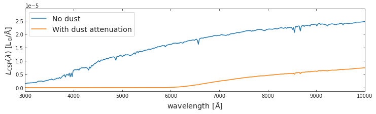
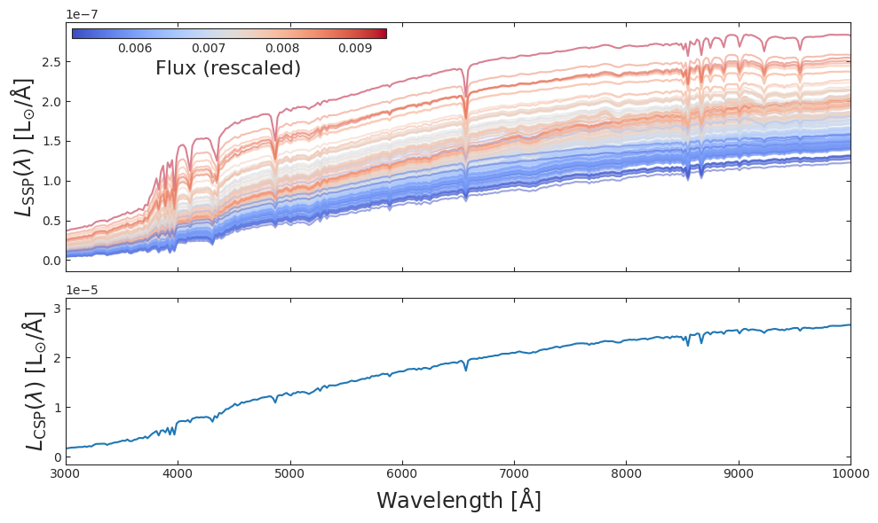
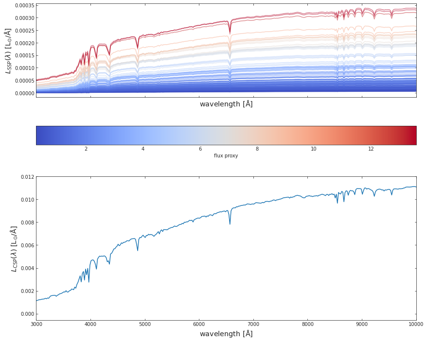
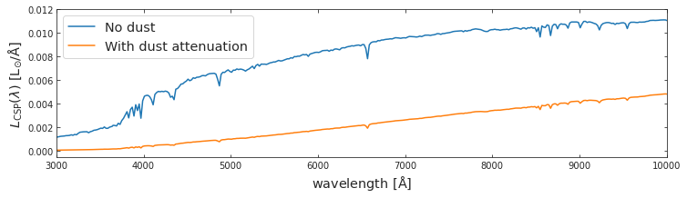

# WATERCOLOR

<!-- WARNING: THIS FILE WAS AUTOGENERATED! DO NOT EDIT! -->

## Installation

Temporary installation:

``` sh
pip install git+https://github.com/nesar/watercolor.git
```

Future:

``` sh
pip install watercolor
```

## Simple implementation to HACC hydro data

#### 1. First we import the following modules of hydro_colors

``` python
import watercolor
from watercolor.load_sim_stellar_catalog import load_hacc_galaxy_data
from watercolor.calculate_csp import calc_fluxes_for_galaxy
from watercolor.load_sps_library import LIBRARY_FLUX_FILE, LIBRARY_WAVE_FILE, LIBRARY_AGE_FILE, LIBRARY_METAL_FILE
from watercolor.dust_attenuation import spectrum_dusted
from watercolor.cosmic_distance_effects import combine_redshift_and_dimming_effect
from watercolor.filter_convolution import load_survey_pickle, photometry_from_spectra
```

#### 2. Then the galaxy-star catalog from HACC is loaded, using a unique galaxy tag, we select a galaxy

``` python
galaxy_star_catalog_file = '../watercolor/data/test_hacc_stellar_catalog/Gals_Z0_576.txt'
galaxy_tags, stellar_idx, metal_hydro, mass, age_hydro, x, y, z , vx, vy, vz = watercolor.load_sim_stellar_catalog.load_hacc_galaxy_data(galaxy_star_catalog_file)
```

``` python
galaxy_number = 1
unique_galaxy_tag = np.unique(galaxy_tags)[galaxy_number]
print('Number of galaxies: %d'%np.unique(galaxy_tags).shape[0])
logmstar = np.array([np.log10( np.sum(mass[galaxy_tags == unique_galaxy_tag]))])
logZ = np.array([np.sum(metal_hydro[galaxy_tags == unique_galaxy_tag])])
```

    Number of galaxies: 10

#### 3. After selecting a unique galaxy tag, we calculate the SED. This is the rest-frame SED is due to spectral emission alone, and without dust attenuation.

``` python
spec_wave_ssp, spec_flux_ssp, spec_csp, flux_proxy, gal_stellar_mass = watercolor.calculate_csp.calc_fluxes_for_galaxy(galaxy_star_catalog_file,
                                                                                                                       unique_galaxy_tag,
                                                                                                                       LIBRARY_FLUX_FILE,
                                                                                                                       LIBRARY_WAVE_FILE,
                                                                                                                       LIBRARY_AGE_FILE,
                                                                                                                       LIBRARY_METAL_FILE)
```

    Library shape:  (22, 94, 1963)
    Wavelength shape:  (1963,)

#### 4. We plot SEDs from both SSPs and CSPs

``` python
fig, a = plt.subplots(2,1, figsize=(14, 12), sharex=True, sharey=False)
c_norm = mpl.colors.Normalize(vmin=np.min(flux_proxy), vmax=np.max(flux_proxy))
c_map  = mpl.cm.coolwarm

s_map  = mpl.cm.ScalarMappable(cmap=c_map, norm=c_norm)
s_map.set_array([])


for idx in range(spec_flux_ssp.shape[0]):
    
    # spec_flux_ssp[idx] = spec_ssp(age_hydro[ssp_id], metal_hydro[ssp_id], mass[ssp_id])
    a[0].plot(spec_wave_ssp, spec_flux_ssp[idx], 
              # color=s_map.to_rgba(np.log10(mass[ssp_id])), 
              color=s_map.to_rgba(flux_proxy[idx]), 
              alpha=0.5)

fig.colorbar(s_map, ax = a[0], 
             orientation = 'horizontal', 
             # label=r'stellar mass', pad=0.2)
             label=r'flux proxy', pad=0.2)
    

#####################################################################

a[1].plot(spec_wave_ssp, spec_csp)


# a[0].set_ylim(1e-9, 1e-6)
# a[0].set_yscale('log')
# a[1].set_yscale('log')
# a[1].set_xscale('log')
a[1].set_xlim(3e3, 1e4)


a[0].set_xlabel(r'${\rm wavelength\ [\AA]}$', fontsize = 'x-large')
a[1].set_xlabel(r'${\rm wavelength\ [\AA]}$', fontsize = 'x-large')
a[0].set_ylabel(r'$L_{\rm SSP}(\lambda)\ {\rm [L_{\odot}/\AA]}$', fontsize = 'x-large')
a[1].set_ylabel(r'$L_{\rm CSP}(\lambda)\ {\rm [L_{\odot}/\AA]}$', fontsize = 'x-large')


plt.show()
```


#### 5. CSPs are attenuation due to dust

``` python
spec_wave_csp_dusted = spectrum_dusted(spec_csp, spec_wave_ssp, logmstar, logZ, 0.01)
```

    0.0 41.012193308819754
    0.0 41.012193308819754
    Library shape:  (22, 94, 1963)
    Wavelength shape:  (1963,)

``` python
f, a = plt.subplots(1, 1, figsize=(12, 3))
a.plot(spec_wave_ssp, spec_csp, label='No dust')
a.plot(spec_wave_ssp, spec_wave_csp_dusted, label='With dust attenuation')

a.set_xlim(3e3, 1e4)

a.set_xlabel(r'${\rm wavelength\ [\AA]}$', fontsize = 'x-large')
a.set_ylabel(r'$L_{\rm CSP}(\lambda)\ {\rm [L_{\odot}/\AA]}$', fontsize = 'x-large')
a.legend(fontsize='x-large')
```

    <matplotlib.legend.Legend>



#### 6. The resulting dust attenuated spectra undergoes cosmic dimming and redshifting

``` python
redsh_wave, redsh_spec = combine_redshift_and_dimming_effect(wave=spec_wave_ssp, 
                                                             spec=spec_wave_csp_dusted, 
                                                             galaxy_redshift=0.001)
```

``` python
f, a = plt.subplots(1, 1, figsize=(12, 3))
a.plot(spec_wave_ssp, spec_csp, label='Pre-distance effects')
a.plot(redsh_wave, redsh_spec*1e6, label='Redshift and dimming')


# a.set_xlim(3e3, 1e4)
a.set_xlim(3e3, 1e6)

a.set_xscale('log')
# a.set_yscale('log')

a.set_xlabel(r'${\rm wavelength\ [\AA]}$', fontsize = 'x-large')
a.set_ylabel(r'$L_{\rm CSP}(\lambda)\ {\rm [L_{\odot}/\AA]}$', fontsize = 'x-large')
a.legend(fontsize='x-large')
```

    <matplotlib.legend.Legend>



#### 7. The final spectrum is convolved with telescope transmission curves to obtain magnitudes

``` python
##### Load survey filters 

SURVEY_STRING = 'SPHEREx'
central_wavelengths, bandpass_wavs, bandpass_vals, bandpass_names = load_survey_pickle(SURVEY_STRING)

##### Compute bandpasses

# sed_um_wave = spec_wave_ssp/1e4
# sed_mJy_flux = spec_csp*1e3
sed_um_wave = redsh_wave/1e4
sed_mJy_flux = redsh_spec*1e3

flux_survey, appmag_ext_survey, band_fluxes_survey = photometry_from_spectra(central_wavelengths, 
                                                                          sed_um_wave, 
                                                                          sed_mJy_flux, 
                                                                          bandpass_wavs, 
                                                                          bandpass_vals, 
                                                                          bandpass_names,
                                                                          interp_kind='linear',
                                                                          plot=True,
                                                                          clip_bandpass=True)
```



``` python
central_wavelengths
```

    [0.7830647373452718,
     0.8183652918029919,
     1.3147458585482406,
     3.8345303932772654,
     1.2563999205881513,
     1.2282892539582364,
     2.4503233753734097,
     4.662096119078615,
     0.8745631735654754,
     4.628738472222066,
     0.8550793736318691,
     2.9500303334601066,
     4.497713406451782,
     1.1740563864174702,
     4.433582369495503,
     2.797382451521238,
     0.8366362003007202,
     0.9140979661997612,
     1.200833842068449,
     4.562749680051651,
     2.5153148657962996,
     1.8979892930776614,
     1.6128965773807502,
     2.8726884548717737,
     4.0693591083217235,
     3.9002163392018474,
     2.582999873922396,
     1.733656019421907,
     3.747092777604912,
     4.034948578767709,
     4.392555874172069,
     0.7662857372139783,
     2.3803324196102285,
     4.973166305823339,
     1.147733858498228,
     3.9670218944612206,
     3.867219343748118,
     1.2852296332892108,
     0.9982709875157418,
     0.9345477497709529,
     0.9557792576728315,
     4.4655391299895495,
     1.068050895522115,
     4.595644952004803,
     0.8006136778609307,
     1.6948339021646766,
     0.9765849266671799,
     4.5301121913008275,
     2.723970242689589,
     1.021266251987677,
     1.8139802785892019,
     2.6525844330812784,
     4.000823494163344,
     1.7733540428424193,
     1.6568734163301386,
     0.894035168739125,
     1.0924771000676867,
     1.0447401768217972,
     3.933454657137669,
     1.1220487469487468,
     1.9414818794825408,
     1.8554813076971435,
     1.3757546951022939,
     1.3147458585482406,
     1.2563999205881513,
     1.2282892539582364,
     0.8550793736318691,
     1.1740563864174702,
     2.797382451521238,
     1.200833842068449,
     1.344894951756316,
     1.4727947763979803,
     1.6128965773807502,
     1.5066406797178662,
     1.407365836516395,
     1.5412408696619009,
     1.5766484553227396,
     1.147733858498228,
     1.2852296332892108,
     1.439688957221757,
     1.068050895522115,
     4.595644952004803,
     4.9375914994127355,
     4.000823494163344,
     2.327030183073332,
     3.6488797546710376,
     4.355384215511507,
     1.1220487469487468,
     1.8554813076971435,
     2.07791224633851,
     2.1255451636016267,
     2.1741848461905398,
     1.2282892539582364,
     2.274904454905787,
     0.8366362003007202,
     4.562749680051651,
     1.8979892930776614,
     1.733656019421907,
     1.985930042232305,
     2.3803324196102285,
     4.902314832063028,
     1.5412408696619009,
     3.9670218944612206,
     2.223995311495257,
     1.6948339021646766,
     2.723970242689589,
     4.318576649353587,
     2.0314192197380225,
     1.8139802785892019,
     1.7733540428424193,
     3.5531973085099304,
     1.6568734163301386,
     2.327030183073332,
     1.0447401768217972,
     1.9414818794825408,
     1.8554813076971435,
     0.8183652918029919,
     3.1111029139636783,
     2.4503233753734097,
     2.9500303334601066,
     2.797382451521238,
     1.200833842068449,
     2.5153148657962996,
     2.8726884548717737,
     2.582999873922396,
     1.5066406797178662,
     3.194860924056649,
     3.747092777604912,
     3.3692856377520544,
     3.4600022317788968,
     2.223995311495257,
     4.5301121913008275,
     2.723970242689589,
     1.021266251987677,
     2.6525844330812784,
     3.280911608781501,
     4.282051789360298,
     1.7733540428424193,
     3.5531973085099304,
     4.867265783194246,
     3.029486861346458,
     3.6488797546710376,
     3.933454657137669,
     4.209947036479122,
     2.1741848461905398,
     3.8345303932772654,
     4.1040563653473034,
     4.497713406451782,
     1.1740563864174702,
     4.832458094082278,
     1.4727947763979803,
     4.0693591083217235,
     3.9002163392018474,
     2.582999873922396,
     1.733656019421907,
     4.034948578767709,
     4.392555874172069,
     3.3692856377520544,
     3.9670218944612206,
     3.867219343748118,
     0.9982709875157418,
     4.139066932122264,
     0.8006136778609307,
     4.1743562575860285,
     4.318576649353587,
     4.000823494163344,
     4.282051789360298,
     4.355384215511507,
     4.24585919129367,
     3.933454657137669,
     2.1255451636016267,
     4.209947036479122,
     0.7830647373452718,
     4.69568982226157,
     4.662096119078615,
     4.797910559544933,
     4.628738472222066,
     4.497713406451782,
     4.433582369495503,
     4.832458094082278,
     4.562749680051651,
     2.5153148657962996,
     4.7635849465965725,
     4.902314832063028,
     4.973166305823339,
     1.147733858498228,
     3.867219343748118,
     1.439688957221757,
     4.4655391299895495,
     4.595644952004803,
     4.9375914994127355,
     1.6948339021646766,
     0.9765849266671799,
     4.5301121913008275,
     3.280911608781501,
     4.867265783194246,
     4.729491247381018]

``` python
##### Load survey filters 

SURVEY_STRING = 'LSST'
central_wavelengths, bandpass_wavs, bandpass_vals, bandpass_names = load_survey_pickle(SURVEY_STRING)

##### Compute bandpasses

# sed_um_wave = spec_wave_ssp/1e4
# sed_mJy_flux = spec_csp*1e3
sed_um_wave = redsh_wave/1e4
sed_mJy_flux = redsh_spec*1e3

flux_survey, appmag_ext_survey, band_fluxes_survey = photometry_from_spectra(central_wavelengths, 
                                                                          sed_um_wave, 
                                                                          sed_mJy_flux, 
                                                                          bandpass_wavs, 
                                                                          bandpass_vals, 
                                                                          bandpass_names,
                                                                          interp_kind='linear',
                                                                          plot=True,
                                                                          clip_bandpass=True)
```

    /lcrc/project/cosmo_ai/nramachandra/Projects/Hydro_paint/watercolor/watercolor/filter_convolution.py:158: RuntimeWarning: divide by zero encountered in log10
      appmag_ext = -2.5*np.log10(flux)+23.9



``` python
##### Load survey filters 

SURVEY_STRING = 'COSMOS'
central_wavelengths, bandpass_wavs, bandpass_vals, bandpass_names = load_survey_pickle(SURVEY_STRING)


##### Compute bandpasses

# sed_um_wave = spec_wave_ssp/1e4
# sed_mJy_flux = spec_csp*1e3
sed_um_wave = redsh_wave/1e4
sed_mJy_flux = redsh_spec*1e3

flux_survey, appmag_ext_survey, band_fluxes_survey = photometry_from_spectra(central_wavelengths, 
                                                                          sed_um_wave, 
                                                                          sed_mJy_flux, 
                                                                          bandpass_wavs, 
                                                                          bandpass_vals, 
                                                                          bandpass_names,
                                                                          interp_kind='linear',
                                                                          plot=True,
                                                                          clip_bandpass=True)
```


<!-- ### One can also find luminosity profiles for the simulated galaxies -->
<!-- #### 1. First we project the luminosity on to grids -->
<!-- #### 2. Next we plot the stellar density and luminosity profiles -->
<!-- ### Radial mass profile of the galaxy -->
<!-- ## Under the hood -->
